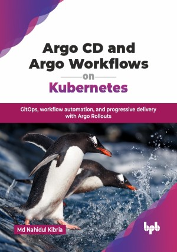

# Argo CD and Argo Workflows on Kubernetes

GitOps, workflow automation, and progressive delivery with Argo Rollouts.

This is the repository for [Argo CD and Argo Workflows on Kubernetes
](https://bpbonline.com/products/argo-cd-and-argo-workflows-on-kubernetes?variant=44348444967112),published by BPB Publications.

## About the Book
Git is a widely used version-control system in software development, essential for managing infrastructure as code (IaC), where code defines infrastructure. Kubernetes enhances IaC with GitOps, using Git as the single source of truth for managing operations. The Argo Family offers cloud-native tools designed to simplify the management of jobs and applications on Kubernetes, seamlessly integrating with the GitOps framework.

This book begins with a quick start on setting up Argo Projects in a local cluster, followed by an in-depth look at concepts and architecture. Readers will then explore production readiness, security considerations, and team-specific needs, such as user access with single sign-on, declarative configuration changes, observability, and disaster recovery. Once familiar with a production-ready setup, the book deliberates on integrating Argo Workflow, Argo Events, and Argo Rollouts, highlighting their combined capabilities. Finally, the book compares Argo with alternative tools, helping readers assess and choose the best options for their needs.

By the end of the book, readers will have a solid understanding of GitOps fundamentals, Kubernetes integration, and advanced deployment strategies. Covering the entire Argo ecosystem with Argo CD, Argo Workflows, Argo Rollouts, and Argo Events. This guide will help readers utilize the full potential of these powerful tools, transforming how they manage and deliver applications in their organizations.

## What You Will Learn
• Automate deployment processes with Argo CD. 

• Deploy new features and software versions confidently with Rollouts.

• Leverage cloud-native workflows to automate daily tasks in familiar Kubernetes environments.

• Collaborate seamlessly across teams using Argo Projects' robust capabilities, such as Argo CD Notifications and Argo Events.

• Use Argo tools like Argo Rollouts to identify and resolve issues quickly.

• Stay up-to-date with the latest DevOps trends and technologies.
